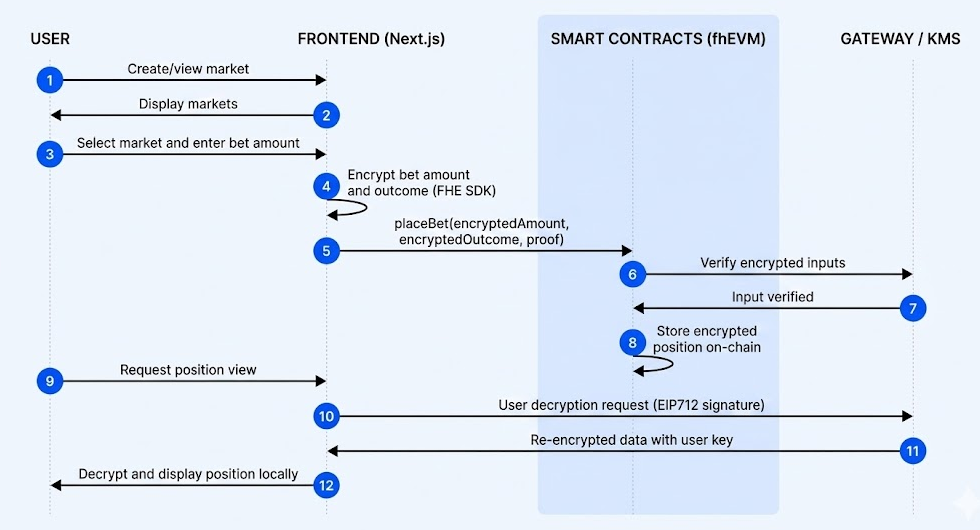

# BlindBet

A fully confidential prediction market platform built on Zama's fhEVM, enabling truly private betting where positions, amounts, and outcomes remain encrypted until settlement.

## The Problem with Current Prediction Markets

Traditional prediction markets suffer from a fundamental transparency paradox. On platforms like Polymarket, Augur, and Gnosis, large traders can observe incoming bets in the mempool and front-run them, manipulating odds before transactions confirm. Market makers see the exact distribution of positions, allowing them to adjust spreads unfairly. The public nature of positions creates a chilling effect where users avoid placing large bets or taking contrarian positions for fear of signaling their beliefs to competitors.

### Traditional Markets vs BlindBet

| Aspect | Traditional Markets | BlindBet |
|--------|-------------------|----------|
| **Position Visibility** | Public - Anyone can see all positions | Encrypted - Only you see your positions |
| **Front-running** | Vulnerable to mempool monitoring | Impossible - No data to front-run |
| **Market Manipulation** | Whales can see and manipulate order flow | Protected - Distribution stays hidden |
| **Privacy** | Zero - All bets publicly visible | Complete - FHE encryption on-chain |
| **Fair Competition** | Favors sophisticated MEV actors | Level playing field for all participants |

## How Zama's fhEVM Enables True Privacy

BlindBet leverages Zama's Fully Homomorphic Encryption (FHE) technology to create the first truly confidential prediction market. Unlike zero-knowledge proofs which only verify computations, FHE allows computations directly on encrypted data. Smart contracts can add encrypted bet amounts, compare encrypted positions, and calculate encrypted payouts without ever seeing plaintext values.

### FHE vs Zero-Knowledge Proofs

| Feature | Zero-Knowledge Proofs | Zama's FHE (BlindBet) |
|---------|----------------------|---------------------|
| **Computation** | Verify results without inputs | Compute directly on encrypted data |
| **Data Privacy** | Inputs remain hidden | Data never decrypted on-chain |
| **Smart Contract Support** | Limited operations | Full arithmetic, comparisons, conditionals |
| **Decryption** | Not applicable | User-specific keys via oracle |
| **Performance** | Proof generation overhead | Native encrypted operations |

## Platform Capabilities

| Capability | Description |
|------------|-------------|
| **Market Creation** | Create binary outcome markets on any topic |
| **Encrypted Betting** | Place fully encrypted bets with guaranteed privacy |
| **Position Viewing** | Secure decryption mechanism for personal positions only |
| **Automated Payouts** | Smart contract-based winner distribution after resolution |
| **Transaction History** | Complete history across all markets with confidentiality maintained |
| **Dual-Signature Transfers** | Separate patterns for user-initiated and contract transfers |
| **ACL Permissions** | Granular access control for encrypted data |
| **Oracle Integration** | Seamless integration with Zama's decryption oracle |

## System Architecture



The BlindBet architecture consists of three primary layers: the client-side encryption layer where users generate encrypted bets using the fhEVM SDK, the smart contract layer where all market logic executes on encrypted data, and the oracle layer that handles secure decryption requests for position viewing and market settlement. This three-tier design ensures that sensitive data never exists in plaintext on-chain while maintaining full functionality and verifiability.

## Technology Stack

| Category | Technology | Purpose |
|----------|-----------|---------|
| **Blockchain** | fhEVM | Zama's Fully Homomorphic Encryption Virtual Machine |
| | Solidity | Smart contract development |
| | Hardhat | Development environment and testing |
| | Ethers.js v6 | Blockchain interaction |
| **Frontend** | Next.js 15 | React framework with App Router |
| | TypeScript | Type-safe development |
| | Tailwind CSS | Utility-first styling |
| | shadcn/ui | UI component library |
| **Infrastructure** | Zama Sepolia Testnet | Deployment network |
| | Server-side caching | Optimized RPC usage |
| | Rate limit handling | Graceful degradation |

## Getting Started

### Prerequisites

```bash
node >= 18.0.0
npm >= 9.0.0
```

### Installation

1. Clone the repository

```bash
git clone https://github.com/Gmin2/blindbet.git
cd blindbet
```

2. Install dependencies

```bash
# Root dependencies
npm install

# Frontend dependencies
cd app/frontend
npm install
```

3. Configure environment variables

```bash
# Set Hardhat configuration variables
npx hardhat vars set MNEMONIC
npx hardhat vars set INFURA_API_KEY

# Frontend environment (.env.local in app/frontend)
NEXT_PUBLIC_CHAIN_ID=8009
NEXT_PUBLIC_RPC_URL=https://sepolia.zama.network
```

### Smart Contract Deployment

```bash
# Compile contracts
npm run compile

# Run tests
npm test

# Deploy to Zama Sepolia
npx hardhat deploy --network sepolia
```

### Frontend Development

```bash
cd app/frontend

# Start development server
npm run dev

# Build for production
npm run build

# Start production server
npm start
```

## Smart Contract Overview

### BlindBetMarket.sol

Core market functionality with FHE operations:

```solidity
// Place encrypted bet
function placeBet(
  uint256 marketId,
  externalEuint64 encryptedAmount,
  externalEbool encryptedOutcome,
  bytes calldata inputProof
) external;

// View encrypted position
function getEncryptedPosition(
  uint256 marketId,
  address user
) external view returns (euint64 yesAmount, euint64 noAmount, ebool hasPosition);

// Claim winnings after resolution
function claimWinnings(uint256 marketId) external;
```

### ConfidentialERC20.sol

FHE-enabled token with dual-signature pattern:

```solidity
// For user-initiated transfers (fresh encrypted inputs)
function transfer(address to, externalEuint64 encryptedAmount, bytes calldata inputProof) external returns (bool);

// For contract-to-contract transfers (existing encrypted values)
function transferEncrypted(address to, euint64 amount) external returns (bool);
```

## Key Innovations

### 1. Confidential State Management

All sensitive data stored as encrypted types:

```solidity
struct Position {
  euint64 yesAmount; // Encrypted
  euint64 noAmount; // Encrypted
  ebool hasPosition; // Encrypted
  bool claimed; // Public (safe after resolution)
}
```

### 2. Balance Verification Pattern

Handles silent failures in encrypted transfers:

```solidity
euint64 balanceBefore = token.balanceOf(address(this));
token.transferFromEncrypted(msg.sender, address(this), amount);
euint64 balanceAfter = token.balanceOf(address(this));
euint64 actualAmount = FHE.sub(balanceAfter, balanceBefore);
```

### 3. Conditional Logic Without Branching

Uses FHE.select for encrypted conditionals:

```solidity
position.yesAmount = FHE.select(
    outcome,
    FHE.add(position.yesAmount, actualAmount),
    position.yesAmount
);
```

### 4. ACL Permission Management

Granular access control for encrypted data:

```solidity
FHE.allowThis(encryptedValue);              // Contract access
FHE.allow(encryptedValue, user);             // User access
FHE.allowTransient(amount, address(other));  // Temporary access
```

## Testing

### Smart Contract Tests

```bash
# Run all tests
npm test

# Run specific test file
npx hardhat test test/core/BlindBetMarket.test.ts

# Run with gas reporting
REPORT_GAS=true npm test
```

### Test Coverage

| Status | Count | Description |
|--------|-------|-------------|
| Passing | 197 | All core functionality verified |
| Pending | 6 | FHEVM plugin limitations |
| Failing | 0 | Production ready |

### Test Categories

| Category | Description |
|----------|-------------|
| Token operations | ERC20 transfers and approvals |
| Market creation and validation | Input validation and market initialization |
| Betting functionality | Encrypted bet placement and position tracking |
| Market locking and resolution | State transitions and oracle integration |
| Claims and payouts | Winner calculations and distributions |
| Factory operations | Market deployment and management |
| Fee management | Protocol fee calculations |
| Security edge cases | Attack vectors and edge cases |
| Full integration flows | End-to-end market lifecycle |

## Security Considerations

### Smart Contract Security

- ReentrancyGuard on all state-changing functions
- Custom errors for gas optimization
- Input validation at all entry points
- ACL permission verification
- Silent failure handling for encrypted transfers

### FHE-Specific Security

- No branching on encrypted values
- Balance verification after transfers
- Proper ACL permission management
- Request ID validation in oracle callbacks
- Signature verification for decryption

## Deployment

### Contract Addresses (Zama Sepolia)

| Contract | Address | Explorer |
|----------|---------|----------|
| BlindBetFactory | `0xd3fca2bd814176e983667674ea1099d3b75c0bc7` | [View on Explorer](https://sepolia.explorer.zama.ai/address/0xd3fca2bd814176e983667674ea1099d3b75c0bc7) |
| ConfidentialUSDC | `0x8af03bccc2994e191c7aef30a8ca90c47f0e1e8d` | [View on Explorer](https://sepolia.explorer.zama.ai/address/0x8af03bccc2994e191c7aef30a8ca90c47f0e1e8d) |

## Roadmap

### Phase 1: Core Functionality

- [X] Basic market creation and betting
- [X] Encrypted position tracking
- [X] Market resolution and claims
- [X] Frontend integration

### Phase 2: Enhanced Features

- [ ] Automated Market Maker (AMM)
- [ ] Liquidity provision
- [ ] Partial position closing
- [ ] Advanced analytics

### Phase 3: Advanced Privacy

- [ ] Multi-outcome markets
- [ ] Conditional betting
- [ ] Reputation system
- [ ] Order book system

## Contributing

We welcome contributions! Please follow these guidelines:

1. Fork the repository
2. Create a feature branch (`git checkout -b feature/amazing-feature`)
3. Commit your changes (`git commit -m 'feat: add amazing feature'`)
4. Push to the branch (`git push origin feature/amazing-feature`)
5. Open a Pull Request

### Commit Convention

We use [Conventional Commits](https://www.conventionalcommits.org/):

| Prefix | Purpose |
|--------|---------|
| `feat:` | New feature |
| `fix:` | Bug fix |
| `docs:` | Documentation changes |
| `style:` | Code style changes (formatting, etc.) |
| `refactor:` | Code refactoring |
| `test:` | Adding or updating tests |
| `chore:` | Maintenance tasks |

## License

This project is licensed under the BSD-3-Clause-Clear License - see the [LICENSE](LICENSE) file for details.

## Contact

- **GitHub**: [Gmin2/blindbet](https://github.com/Gmin2/blindbet)
- **X**: [@Min2_gg](https://x.com/Min2_gg)
- **LinkedIn**: [mintu-gogoi](https://linkedin.com/in/mintu-gogoi)


---

Built with privacy at the core by Gmin2. Powered by Zama fhEVM.
