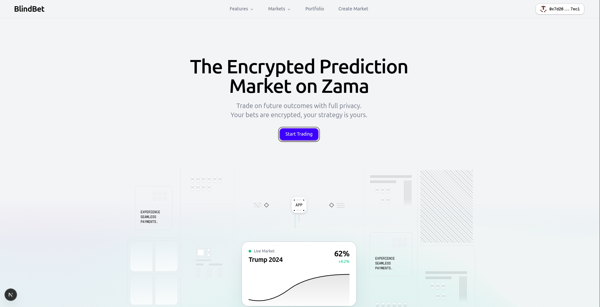
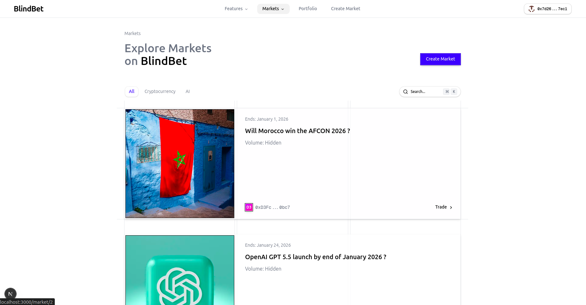
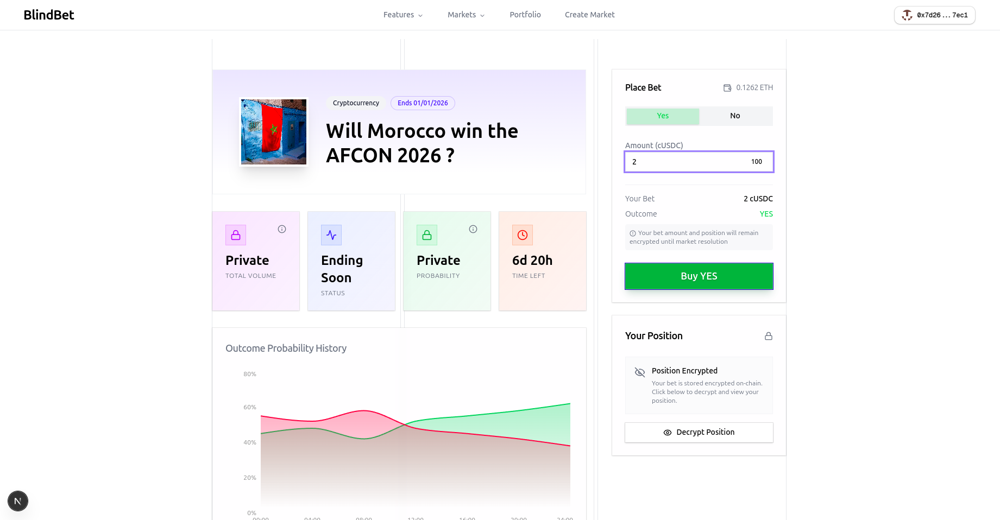
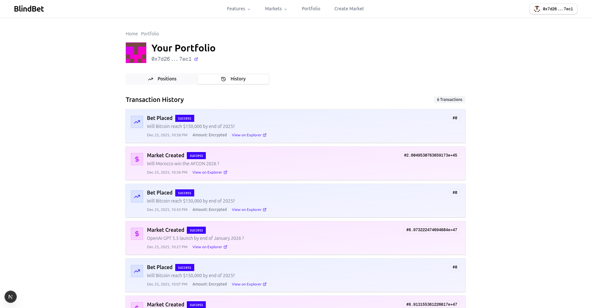
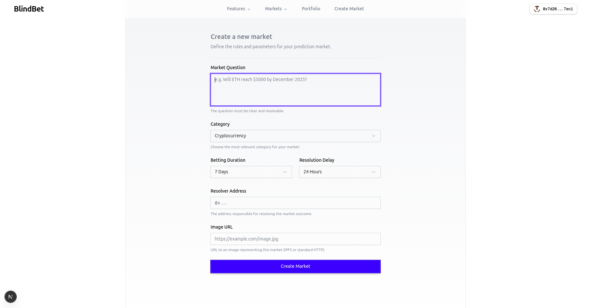

# BlindBet Frontend

A modern, privacy-first prediction market interface built with Next.js 15 and Zama's fhEVM technology. The frontend provides a seamless user experience for creating markets, placing encrypted bets, and managing positions with complete confidentiality.

## Overview

BlindBet's frontend is a fully responsive web application that enables users to interact with confidential prediction markets. All sensitive data including bet amounts and positions are encrypted client-side before being submitted to the blockchain, ensuring complete privacy throughout the betting lifecycle.

## Key Features

| Feature | Description |
|---------|-------------|
| **Market Discovery** | Browse and filter all available prediction markets with real-time status |
| **Encrypted Betting** | Place bets with amounts and positions encrypted using fhEVM SDK |
| **Portfolio Management** | View and manage all your positions across multiple markets |
| **Secure Decryption** | Decrypt your positions locally using EIP712 signatures |
| **Real-time Updates** | Live market status, deadlines, and resolution tracking |
| **Wallet Integration** | Seamless connection with MetaMask and other Web3 wallets |
| **Responsive Design** | Optimized experience across desktop, tablet, and mobile devices |

## Screenshots

### Landing Page


The landing page introduces users to BlindBet's privacy-preserving prediction markets with clear value propositions and feature highlights.

### Markets Overview


Browse all available markets with filtering options, real-time status indicators, and quick access to betting interfaces.

### Market Detail & Betting


Detailed market view with encrypted betting interface, market information, and position management.

### Portfolio Dashboard


Comprehensive portfolio view showing all your positions, claimable winnings, and transaction history with confidentiality maintained.

### Create Market


Intuitive market creation interface for setting up new prediction markets with custom parameters.

## Installation
1. Navigate to the frontend directory

```bash
cd app/frontend
```

2. Install dependencies

```bash
npm install
```

3. Configure environment variables

Create a `.env.local` file in the frontend directory:

```bash
# Blockchain Configuration
NEXT_PUBLIC_CHAIN_ID=8009
NEXT_PUBLIC_RPC_URL=https://sepolia.zama.network

# Contract Addresses
NEXT_PUBLIC_FACTORY_ADDRESS=0xd3fca2bd814176e983667674ea1099d3b75c0bc7
NEXT_PUBLIC_TOKEN_ADDRESS=0x8af03bccc2994e191c7aef30a8ca90c47f0e1e8d

# Gateway Configuration (Optional)
NEXT_PUBLIC_GATEWAY_URL=https://gateway.zama.ai
```

## Development

Start the development server:

```bash
npm run dev
```

Open [http://localhost:3000](http://localhost:3000) in your browser.

## Build & Deploy

Build for production:

```bash
npm run build
```

Start production server:

```bash
npm start
```


## Environment Variables

| Variable | Description | Required |
|----------|-------------|----------|
| `NEXT_PUBLIC_CHAIN_ID` | Zama Sepolia chain ID (8009) | Yes |
| `NEXT_PUBLIC_RPC_URL` | RPC endpoint for blockchain connection | Yes |
| `NEXT_PUBLIC_FACTORY_ADDRESS` | BlindBetFactory contract address | Yes |
| `NEXT_PUBLIC_TOKEN_ADDRESS` | ConfidentialUSDC token address | Yes |
| `NEXT_PUBLIC_GATEWAY_URL` | Gateway URL for fhEVM operations | No |

## Key Components

### Wallet Connection

```typescript
import { useWallet } from '@/hooks/useWallet';

const { address, connect, disconnect, isConnected } = useWallet();
```

### Market Fetching

```typescript
import { useMarkets } from '@/hooks/useMarkets';

const { markets, loading, error, refetch } = useMarkets();
```

### Placing Encrypted Bets

```typescript
import { usePlaceBet } from '@/hooks/usePlaceBet';

const { placeBet, loading } = usePlaceBet();

await placeBet({
  marketId: 0,
  amount: '100',
  outcome: true, // true = Yes, false = No
});
```

### Creating Markets

```typescript
import { useCreateMarket } from '@/hooks/useCreateMarket';

const { createMarket, loading } = useCreateMarket();

await createMarket({
  question: 'Will ETH reach $5000 by end of 2025?',
  bettingDuration: 7 * 24 * 3600, // 7 days
  resolutionDelay: 1 * 24 * 3600, // 1 day
  resolver: '0x...',
});
```

## Features in Detail

### Client-Side Encryption

All sensitive data is encrypted before leaving the user's browser:

1. User enters bet amount and selects outcome
2. fhEVM SDK encrypts the data client-side
3. Encrypted data + proof submitted to smart contract
4. Smart contract performs computations on encrypted data
5. Results remain encrypted on-chain

### Position Decryption

Users can decrypt their positions securely:

1. Request position data from smart contract (still encrypted)
2. Generate ephemeral keypair for decryption
3. Sign EIP712 message to authorize decryption
4. Gateway re-encrypts data with user's public key
5. User decrypts locally with private key

### Market States

| State | Description | User Actions |
|-------|-------------|--------------|
| **Open** | Accepting bets | Place bets, view markets |
| **Locked** | Betting closed, awaiting resolution | View positions, wait for resolution |
| **Resolved** | Winner determined | Claim winnings if won |

## Contributing

See the main repository [CONTRIBUTING.md](../../CONTRIBUTING.md) for guidelines.

## License

This project is licensed under the BSD-3-Clause-Clear License - see the [LICENSE](../../LICENSE) file for details.

## Contact

- **GitHub**: [Gmin2/blindbet](https://github.com/Gmin2/blindbet)
- **X**: [@Min2_gg](https://x.com/Min2_gg)
- **LinkedIn**: [mintu-gogoi](https://linkedin.com/in/mintu-gogoi)

---

Built with privacy at the core. Powered by Zama fhEVM.
